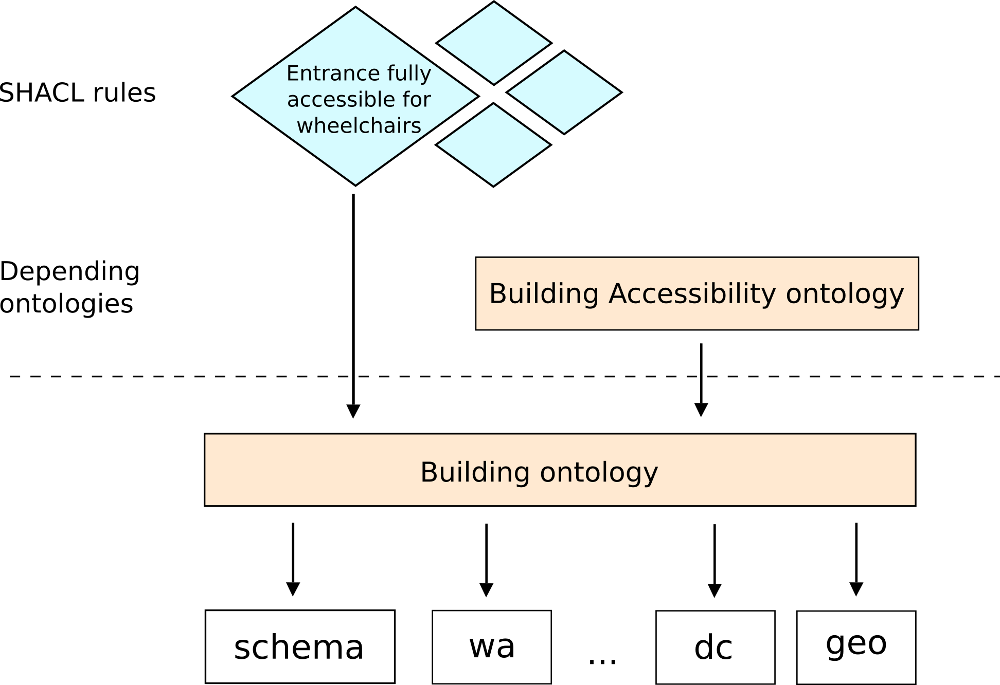

# Building ontology

This ontology describes fact about a building. In following figure illustrates this ontology. It depends on known vocabularies/ontologies like dc, dcterms, skos, geo, [wa](http://semweb.mmlab.be/ns/wa#) and schema.org. Upon the building ontology, more detailed ontologies can be built, like the building [accessibility ontology](https://github.com/AKSW/leds-asp-f-ontologies/tree/master/ontologies/building-accessibility). 

Furthermore the building ontology helps formulate constraints ([SHACL rules](https://www.w3.org/TR/shacl/)). There are SHACL rules available, which describe accessibility aspects of a building, for instance, if [entrance is partyl/fully accessible by wheelchair users](https://github.com/schreckl/rules/blob/master/rules/accessible-building/).

## Acknowledgements

The building ontology is partly inspired by M. Goetz and A. Zipf (Related paper: [Extending OpenStreetMap to Indoor Environment: Bringing Volunteered Geographic Information to the Next Level](http://koenigstuhl.geog.uni-heidelberg.de/publications/2011/Goetz/Goetz-Zipf_2011_IndoorOSM.pdf)). 

But, properties and classes are based on the data model of the [CSV file](https://github.com/AKSW/transform-bvl-pages-to-csv-file), provided by the Behindertenverband Leipzig e.V. It contains information about locations in Leipzig and their degree of accessibility. We separated architectural specifc information (this ontology) from information about accessibility ([building accessibility ontology](https://github.com/AKSW/leds-asp-f-ontologies/tree/master/ontologies/building-accessibility)).

The following major vocabularies are in use:

* [Dublin Core](http://purl.org/dc/elements/1.1/)
* [The vocabulary for (L)OD description of wheelchair accessibility](http://semweb.mmlab.be/ns/wa#)
* [SKOS](http://www.w3.org/2004/02/skos/core#)
* [schema.org](http://schema.org)
